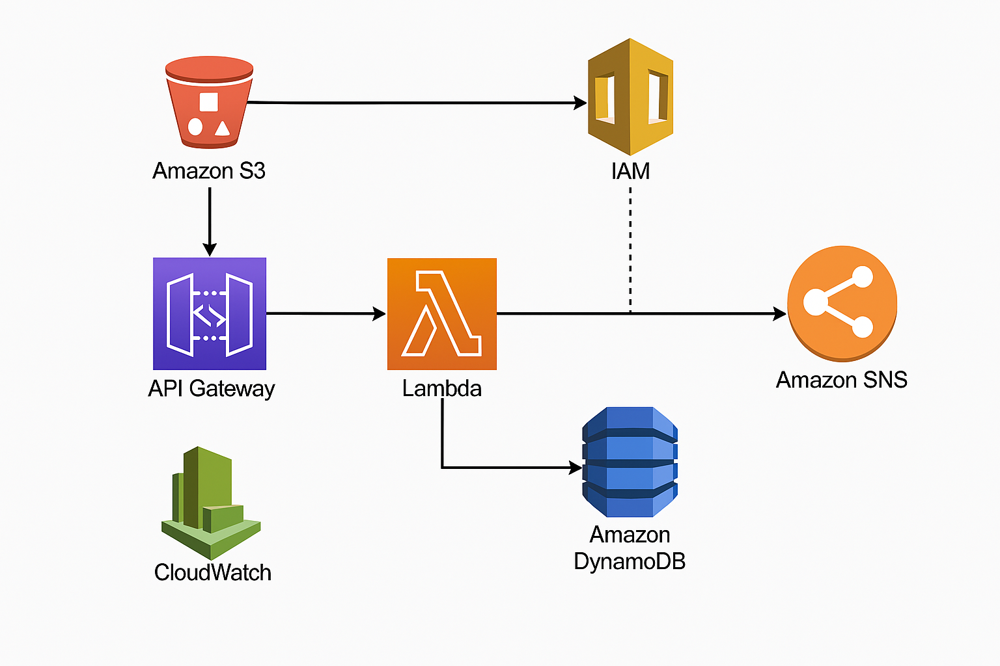
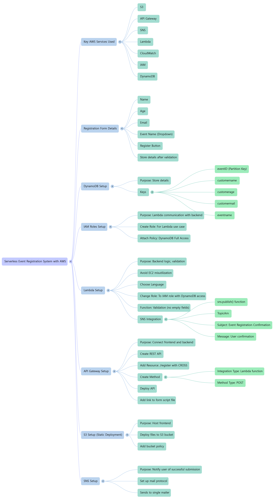
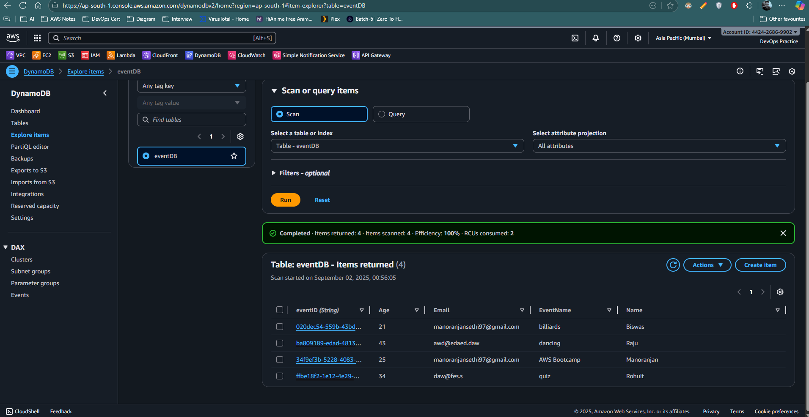
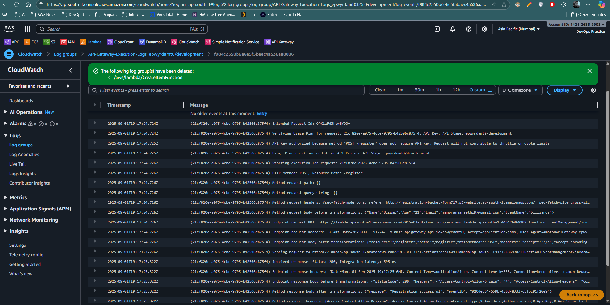
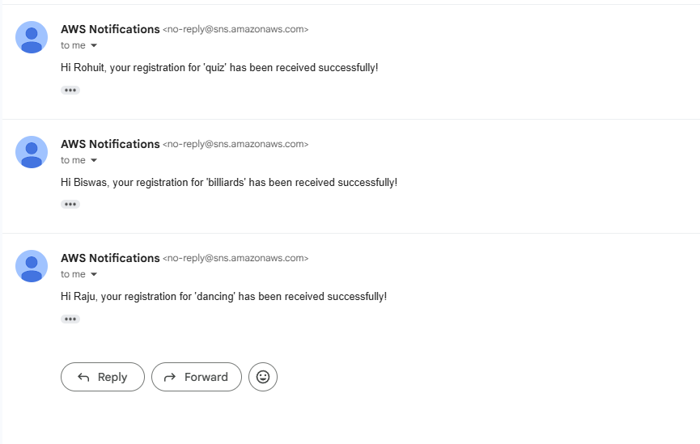

# AWS Serverless Event Registration Form 🎉

This project demonstrates how to build a **fully serverless event registration system** using **AWS services** without relying on EC2 instances. It highlights the benefits of serverless design — scalability, cost efficiency, and reduced infrastructure overhead.

---

## 🛠️ Services Used

* **Amazon S3** → Host the frontend (static HTML form).
* **Amazon API Gateway** → Connect frontend with backend securely.
* **AWS Lambda** → Handle validation and business logic.
* **Amazon DynamoDB** → Store registration details.
* **Amazon SNS** → Send confirmation notifications via email.
* **Amazon CloudWatch** → Debugging and log monitoring.
* **AWS IAM** → Manage secure permissions between services.

---

## 📋 Project Workflow

1. User opens the **registration form** hosted on **S3**.
2. On form submission → request sent to **API Gateway (POST method)**.
3. **API Gateway** triggers **Lambda** function.
4. Lambda validates input (ensures no empty fields).
5. Valid data is stored in **DynamoDB** (Partition Key: `eventID`).
6. Lambda publishes a success notification to **SNS**.
7. User receives an **email confirmation**.

---

## 🖼️ Architecture

```
👤 User → 🪣 S3 (Frontend Hosting) → 🔗 API Gateway → λ Lambda
   → 📊 DynamoDB (DB Storage)
   → ✉️ SNS (Email Notification)
   → 📈 CloudWatch (Logs & Debugging)
```

---

## 📂 DynamoDB Schema

| Attribute    | Type   | Description                   |
| ------------ | ------ | ----------------------------- |
| eventID      | String | **Partition Key** (Unique ID) |
| customername | String | Name of registrant            |
| customerage  | Number | Age of registrant             |
| customermail | String | Email of registrant           |
| eventname    | String | Event name selected           |

---

## 🔑 IAM Setup

* Create a **role** with **Lambda as Use Case**.
* Attach **AmazonDynamoDBFullAccess** policy.
* Attach **AmazonSNSFullAccess** policy.

---

## ⚡ Lambda Function

* Validates that no field is empty.
* Writes data into DynamoDB.
* Publishes confirmation email using SNS.


---

## 🚀 Deployment Steps

1. **DynamoDB** → Create table `EventRegistration` with `eventID` as Partition Key.
2. **IAM** → Create role for Lambda with DynamoDB + SNS permissions.
3. **Lambda** → Write and deploy function with created role.
4. **SNS** → Create topic `FormSubmissionTopic` and subscribe an email.
5. **API Gateway** → Create REST API → resource `/register` → method `POST`.

   * Enable **Lambda Proxy Integration**.
   * Deploy API and get endpoint URL.
6. **S3** → Upload frontend HTML/JS → enable static website hosting.

   * Update form action URL with API Gateway endpoint.
7. **CloudWatch** → Monitor logs and debug issues.

---

## 🐞 Challenge & Fix

* **Issue:** Form submission worked in Lambda test console but **failed via S3 frontend** with error:

  ```
  "statusCode": 405, "body": "{\"error\": \"Method not allowed\"}"
  ```
* **Root Cause:** API Gateway method wasn’t configured with **Lambda Proxy Integration**.
* **Fix:** Enabled Proxy Integration → request passed correctly → system worked end-to-end ✅.

---
## 📸 Screenshots

Architectural Diagram



Project Flow



Event Registration Form


DynamoDB Table



CloudWatch Logs



SNS Service



---

## 📚 Key Learnings

* Serverless saves resources compared to EC2 hosting.
* Debugging with **CloudWatch** is essential when API calls silently fail.
* Proper **API Gateway + Lambda integration** is key for smooth workflows.


